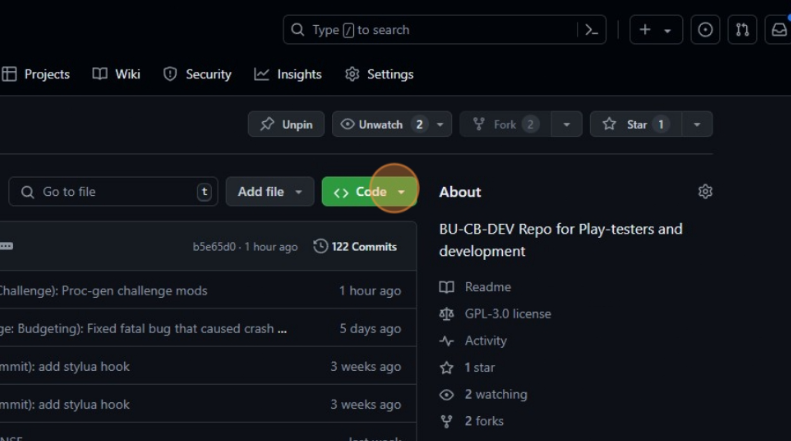
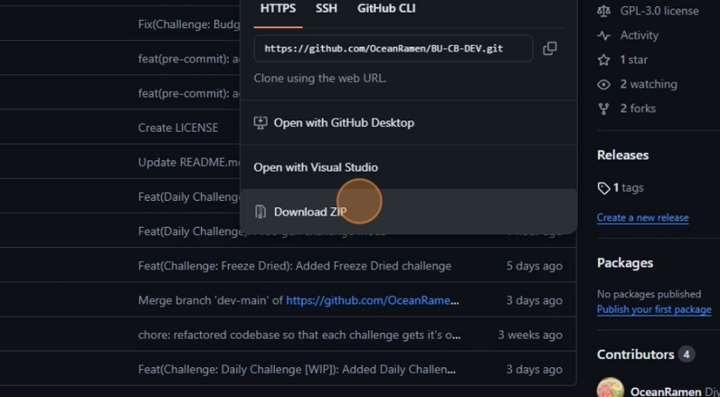

# BU-CB-DEV

## For Playtesters: How to download the latest version
>
> [!WARNING]
> Unreleased code may have fatal errors.

**Step 1.**
> Navigate to <https://github.com/OceanRamen/BU-CB-DEV>

**Step 2.**
> Click "Code"
> 
> 

**Step 3.**
> Click "Download ZIP"
> 
> 

**TODO**
[ ]: Rewrite `cm_all_facedown`
[ ]: Implement Daily Challenge Modifiers
[ ]: Refactor `mechanics.lua`

> [!NOTE]
> This repository is the active development branch of [BU-CB](https://github.com/OceanRamen/BU-CB) and potentially unstable.

Developers: OceanRamen, Surskitt, Cheerio1101

A big thanks to all our play-testers, including but not limited to:

- CampfireCollective
- DrSpectred
- SugarryBoi
- Smokesniper
